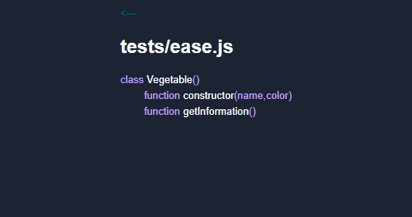

# Replit Symbols Extension

The replit symbols extension is a helpful extension that helps you find functions in your code, _without_ ctrl + f

# Why?

It supports larger projects on replit. Replit is mainly side projects right now, because it doesn't have the tools to support large ones. This aims to start making replit want to start developing those tools

The main motivation comes from when I first suggested it in a post on the replit forum. It got locked by a moderator almost immediately. Since I was lucky enough to get into the extenions beta, I decided if replit wasn't going to do it. I will

# Usage

You can't use un-published extensions yet. If you're apart of the beta and want to, the url is: https://Symbols.darkdarcool.repl.co

# Can I help?

Sorry! I'm not looking for help/other developers on the project. If I want help or want to add you to the project, I'll come to you

# Restrictions

Currently, the bulk of the extension is done. All the I would really need to change, is how the code parser returns all the symbols back to the renderer. It currently supports _very_ bare module JavaScript, but I plan to add more languages in the future

The code files in /tests show you what it is capable of

# Credits

* darkdarcool
  - [replit](https://replit.com/@darkdarcool)
  - [github](https://github.com/darkdarcool)

## Special mentions

So many "thank yous" go to [IronClad](https://connerow.dev/) for allowing me to join the extension beta!